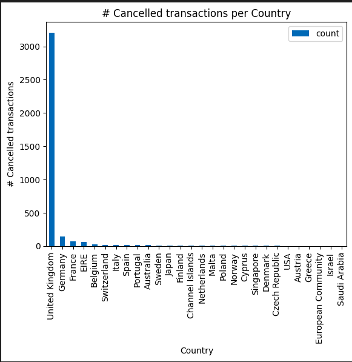

# Big Data Project Document

# ClusterShop
The goal of this project is to use clustering algorithms to segment customers of an online retailer based on their purchasing behavior.

# 2. Problem Description

- The problem this project seeks to solve is **identifying customer segments based** on their **purchasing behavior** in an online retail setting. Online retailers need to understand the behavior of their customers in order to make informed decisions about marketing, inventory management, and customer retention. However, with large amounts of data available on customer transactions, it can be difficult to manually identify patterns and group customers based on their behavior. Clustering algorithms provide a way to automatically group customers based on similar purchasing patterns, but the challenge is in pre-processing and cleaning the data to ensure that the clustering algorithm provides accurate results. This project aims to address these challenges and provide insights into customer behavior for the online retailer.

# 3. Project Pipeline


# 

# 4. EDA

## 4.1 Attribute Information:

- InvoiceNo: Invoice number. Nominal, a 6-digit integral number uniquely assigned to each transaction. If this code starts with letter 'c', it indicates a cancellation.
- StockCode: Product (item) code. Nominal, a 5-digit integral number uniquely assigned to each distinct product.
- Description: Product (item) name. Nominal.
- Quantity: The quantities of each product (item) per transaction. Numeric.
- InvoiceDate: Invice Date and time. Numeric, the day and time when each transaction was generated.
- UnitPrice: Unit price. Numeric, Product price per unit in sterling.
- CustomerID: Customer number. Nominal, a 5-digit integral number uniquely assigned to each customer.
- Country: Country name. Nominal, the name of the country where each customer resides.

## 4.2 Dataset schema

```
root
 |-- InvoiceNo: string (nullable = true)
 |-- StockCode: string (nullable = true)
 |-- Description: string (nullable = true)
 |-- Quantity: long (nullable = true)
 |-- InvoiceDate: timestamp (nullable = true)
 |-- UnitPrice: double (nullable = true)
 |-- CustomerID: double (nullable = true)
 |-- Country: string (nullable = true)
```

## 4.3 Data Cleaning:

- **Filter Out Missing Values in CustomerID column: 135080 records (24.926694334% of dataset size)**
- **Remove Duplicates: 5225 record**

## 4.4 **InvoiceNo**

- number of unique invoices 22190
- Percentage of canceled invoices: 16.466876971608833%
- Not every negative quantity transaction (cancellation) has a positive quantity transaction in our data
- Maybe its positive pair was before the starting date of our data or removed by the data cleaning process (having null CustomerID)

## 4.5 **StockCode**

- Number of unique products: 3684
- There are stock codes with special meanings like:
  - D: Discount
  - BANK CHARGES: Bank Charges
- The most popular item is the one with code 84077 and its quantity is 53119

## 4.6 Description

- Number of keywords:  1482


## 4.7 Quantity


## 4.8 **CustomerID**

- Number of unique customers 4372
- there are customers who only buy small quantities of products and other customers buy large quantities of products


## 4.10 InvoiceDate

- the minimum date is: 2010-12-01 08:26:00
- the maximum date is: 2011-12-09 12:50:00

## 4.11 Country

- Number of countries: 37

- **countries that made most of the transactions**
  
    

- **countries that made most of the cancellations**
  
    

- **countries vs num transactions map**


# 5. Association rules

- we use the frequent pattern algorithm :
  
  1. Memory efficiency
  
  2. Speed
  
  3. Ability to handle sparse data
  
  4. Scalability
     
      

- **for every invoice what are the most probable items to be together**
  
  - support(A) = (number of transactions containing A) / (total number of transactions)
  - confidence(A → B) = support(A ∪ B) / support(A)
  - lift(A → B) = support(A ∪ B) / (support(A) * support(B))
  - we generally want to choose rules with higher values for confidence, lift, and support, as these indicate stronger relationships between the items in the rule. **(we want the upper right more yellow-colored points)**


# 6. **Feature Engineering**

> **Recency Frequency Monetary (RFM) analysis is a technique used in retail and customer relationship management to segment customers based on their purchasing behavior. RFM analysis focuses on three key metrics**

## 6.1 Recency - How recently?

- Seasonality: count (InvoiceNo) per month or quarter for each customer


- Customer Lifetime Value: max date-min date for each customer
  
    

## 6.2 Frequency - How often?

- Frequency Of Purchase: count(InvoiceNo) for each customer
  
    

## 6.3 Monetary value - How much?

- basket price : ((quantity * unit price) for every transaction) per invoice
  
    

- Avg Purchase Value: Total amount spent / Number of purchases for each customer
  
    

- Basket Size: Number of products in an invoice with duplicates
  
    

- basket diversity: Basket diversity = mean(count(unique(StockCode)) per InvoiceNo) for each customer
  
    

- product returns: count(InvoiceNo starts with c / count(InvoiceNo) for each customer
  
    

# 7. Clustering

## 7.1 **K-means Clustering**

> WCSS measures the sum of the squared distances between each data point and the centroid of its assigned cluster.


> 'AvgBasketPrice', 'FrequencyOfPurchases', 'AvgBasketSize', 'CustomerLifetimeValue', 'unique_transactions_q1', 'unique_transactions_q2', 'unique_transactions_q3', 
>  'unique_transactions_q4', 'basket_diversity', 'ProductReturns'

## 7.2 **Bisecting K-means**

```
1. Start with a single cluster that contains all the data points.

2. Repeat the following steps until the desired number of clusters is reached:

    a. Select the cluster with the highest distortion score
     (i.e., the cluster with the largest sum of squared distances
     between its data points and its centroid).

    b. Bisect the selected cluster by running a standard K-means 
         algorithm on its data points, resulting in two new sub-clusters.

    c. Compute the distortion score for the two new sub-clusters 
         and update the distortion scores for all the clusters.

3. The final result is a set of disjoint clusters, each containing
     a subset of the data points.
```

> Distortion score measures the sum of the squared distances between each data point and its assigned centroid, **averaged** over all the data points in the dataset.


## 7.3 **Agglomerative Clustering**

```
1. Start by assigning each data point to its own cluster.

2. Compute the distance between every pair of clusters using 
     a distance metric, such as Euclidean distance or cosine similarity.

3. Merge the two closest clusters into a single new cluster.

4. Recompute the distances between this new cluster 
        and all the other clusters.

5. Repeat steps 3-4 until the desired number of clusters is reached.
```


## 7.4 Clustering Evaluation

| Algorithm               | Training Silhouette Score | Test Silhouette Score |
| ----------------------- | ------------------------- | --------------------- |
| KMeans                  | 0.5279819014447092        | 0.5163033388495715    |
| AgglomerativeClustering | 0.6251689393105582        | 0.48586184749305805   |
| BisectingKMeans         | 0.4539824483834128        | 0.4465306711031442    |

# 8. Business insights:

Based on the **RFM** analysis using the features mentioned, we can segment customers into different groups based on their purchasing behavior. 

1. **High-value, loyal customers:**
   1. Customers who have a high RFM score, indicating that they have **made recent, frequent, and high-value purchases,** could be considered high-value, loyal customers. They may be the **most profitable** customers for the business, and the business could focus on **retaining and rewarding** them with special **promotions** or loyalty programs.
2. Churned customers: 
   1. Customers who have a low RFM score, indicating that they **have not made a purchase recently, have a low frequency of purchase, and have low monetary value**, could be considered as churned customers. The business could focus on **re-engaging** them with **personalized promotions** or incentives to make a purchase.
3. Bargain hunters:
   1. Customers who have a **high frequency of purchases**, but **low monetary value**, could be considered bargain hunters. They may be interested in **low-priced products or discounts**, and the business could focus on offering them targeted promotions or deals.
4. High-spending customers: 
   1. Customers who have a **high monetary value, but a low frequency of purchase**, could be considered high-spending customers. The business could focus on understanding their purchasing behavior and preferences and offering them **personalized recommendations or exclusive products.**
5. Occasional shoppers: 
   1. Customers who have made a few purchases, but have not spent a significant amount of money, could be considered as occasional shoppers. The business could focus on offering them incentives or **personalized recommendations to encourage them to make more purchases**.
